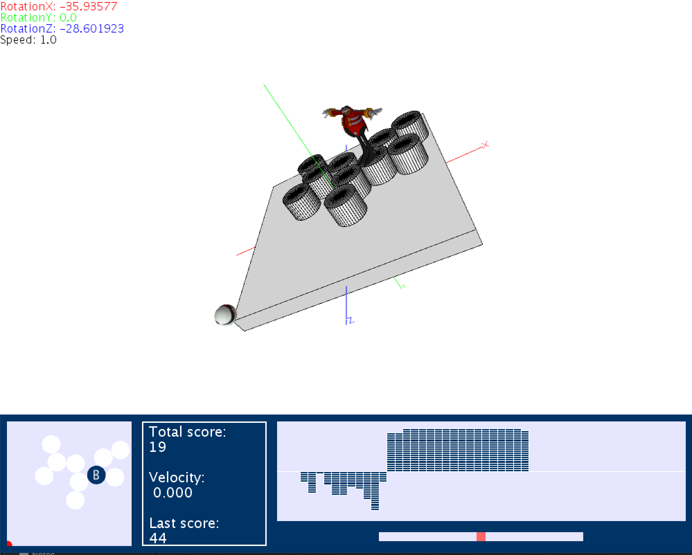

# Tangible
An AR game that allows the player to move a physical board to control a virtual board in order to destroy enemies.
This game is built using the [Processing](https://processing.org) framework.

## The game
To launch the game, open the project using _Processing_ and press run.
The aim of the game is to eliminate [Robotnik](https://en.wikipedia.org/wiki/Doctor_Eggman) in the least amount of time by destroying him and all the cylinders he spawns. To destroy an enemy, you must tilt the board for the ball to hit the enemy, the faster you hit it, the higher the score. To start the game, press **Shift** to place _Robotnik_ on the board.

## Game modes

### Static
The game available in the _staticGame_ folder can be controlled using a mouse.

### AR
The game available in the _webcamGame_ folder can be controlled using a green board in front of your webcam. This board will be detected by the game engine and can be used to control the virtual board in the game.

## Teaser

  

## Contributors
[Squalene](https://github.com/Squalene), [loh0um](https://github.com/loh0um), [macintosh1398](https://github.com/macintosh1398)

